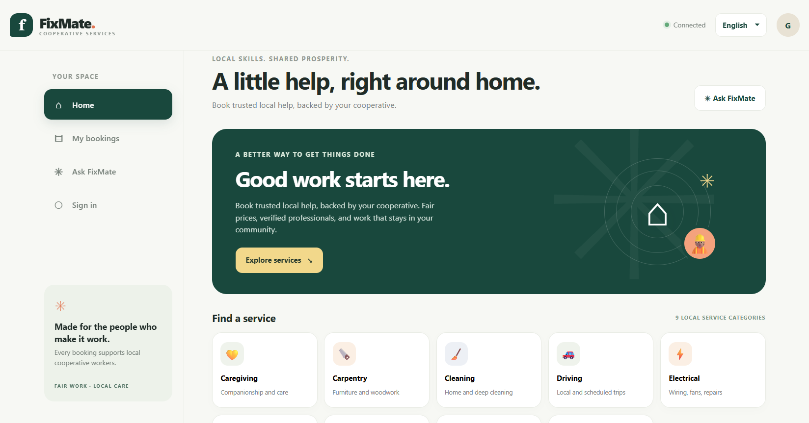
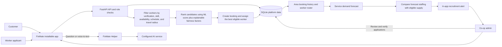

# FixMate - Cooperative Services Marketplace

**Local skills. Fair work. Shared prosperity.**

FixMate is an installable, mobile-first marketplace designed to help **labour cooperatives connect households and institutions with local cooperative workers**. It brings customer bookings, worker profiles, transparent matching, and cooperative administration into one application.



## What makes FixMate different

- **Cooperative-first:** Designed to keep local work and workforce planning visible to labour cooperatives and their members.
- **Three role-based spaces:** Customers book services, workers manage their skills and jobs, and cooperative admins oversee verification and demand.
- **Explainable worker matching:** Eligible workers are ranked using distance, skills, availability, experience, certificates, ratings, and workload. The booking records the candidate count and match factors.
- **Demand-to-recruitment workflow:** Area forecasts are compared with the verified worker roster; staffing gaps create in-app admin alerts.
- **Built for different locations:** Bookings, worker profiles, and forecasts use coordinates, so the workflow is not restricted to Gurugram. Actual matching still depends on verified workers covering the requested area.
- **AI and voice help:** FixMate Helper can answer open-ended questions through an AI service; supported browsers can convert voice input to text.

## Spaces and key features

- **Customer:** Browse nine service categories, create scheduled or urgent bookings, share a service location, see the assigned worker and eligible-worker count, follow booking status, review service, and view an invoice or demo payment record.
- **Worker:** Apply with service skills, experience, certificates, rates, service location, and travel radius; manage availability and assigned jobs; view completed work and welfare records. New profiles require cooperative admin verification before receiving bookings.
- **Co-op admin:** Review and verify worker applications, monitor bookings and service activity, forecast demand by service and coordinates, review staffing shortages, and update recruitment status.

## Data science and machine learning

- **Smart allocation:** A saved scikit-learn model score is combined with an interpretable fairness score. Live requests use current worker and booking data; the model does not automatically retrain after each booking.
- **Demand forecasting:** A `HistGradientBoostingRegressor` is trained on a reproducible, synthetic three-year panel and evaluated with a chronological 90-day holdout. Outside the six demo Gurugram areas, the synthetic prior is a labelled cold-start estimate.
- **Real booking signal:** Non-cancelled requests within 6 km calibrate an area forecast after at least 10 requests spanning 28 days. This uses actual platform activity but does not retrain the forecasting model.
- **Resume-ready honesty:** The saved allocation report shows ROC-AUC **0.670** and NDCG@5 **0.765** on its held-out dataset. These are prototype dataset metrics, not live-service accuracy or a guarantee of worker outcomes.

## Technology stack

- **App:** HTML, CSS, JavaScript, responsive Progressive Web App (PWA), service worker, browser geolocation, and browser speech recognition where supported.
- **Backend:** Python, FastAPI, Pydantic, REST API, role-based access, and signed session tokens.
- **Database:** SQLite for users, worker profiles, bookings, reviews, payment ledger records, and staffing alerts.
- **Data science:** pandas, NumPy, scikit-learn, joblib, model evaluation, temporal validation, and workload analysis.
- **Geospatial matching:** Latitude/longitude, Haversine distance, and worker service-radius checks.
- **AI helper:** AI Pipe/OpenRouter-compatible chat API. Configure `AIPIPE_API_KEY` locally; never commit a real key.
- **Quality checks:** pytest and HTTPX API workflow tests.

## Architecture and workflow



## Demo accounts

| Role | Email | Password |
|---|---|---|
| Customer | `customer@fixmate.local` | `customer123` |
| Verified worker — plumbing | `ravi@fixmate.local` | `worker123` |
| Verified worker — cleaning / caregiving | `meena@fixmate.local` | `worker123` |
| Verified worker — electrical | `amit@fixmate.local` | `worker123` |
| Cooperative admin | `admin@fixmate.local` | `FixMate!2026` |

These credentials are for local demonstrations only. Use private credentials and a strong token secret in any shared environment.

## Run locally

Python 3.11 or newer is recommended.

```powershell
python -m venv .venv
.\.venv\Scripts\python.exe -m pip install -r requirements.txt
.\.venv\Scripts\python.exe -m uvicorn api:app --reload
```

Open <http://127.0.0.1:8000>. Interactive API documentation is at <http://127.0.0.1:8000/docs>. The first startup creates `fixmate.db` and trains the demonstration demand model. Install the PWA through the browser's **Install app** or **Add to Home Screen** option.

## Communication and documentation

- Booking status and recruitment-gap alerts appear in the app; the current prototype does not send SMS, email, or push notifications.
- The AI Helper uses `AIPIPE_API_KEY`; without it, the helper reports that the AI service is not configured. Voice input depends on browser support and permission.
- Read [the model card](docs/MODEL_CARD.md) for data, evaluation, and limitations, and [localization notes](docs/LOCALIZATION.md) for the current English/Hindi interface.

## Prototype boundaries

- Payment choices create demo ledger records; they do not move money or connect to a payment provider.
- Worker verification and welfare fields are cooperative records, not government identity checks or proof of insurance enrollment.
- Addresses are stored as text. Location matching uses coordinates shared by the customer and worker; no address-geocoding provider is connected.
- Forecast results outside areas with enough real booking history are cold-start estimates and should not be presented as locally validated demand.

## Verify

```powershell
python -m pytest -q
```
